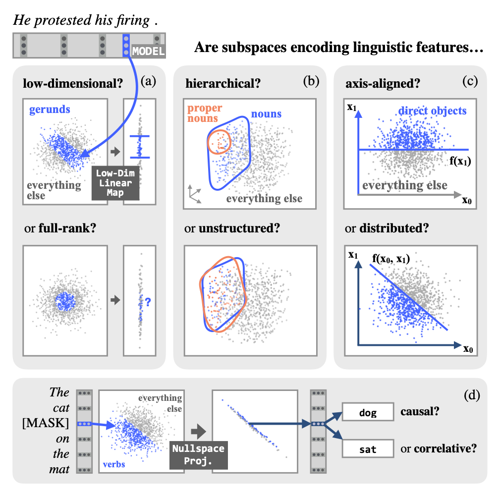

# Low-Dimensional Probing of Word Representations

Code from the CoNLL 2021 paper:

[**The Low-Dimensional Linear Geometry of Contextualized Word Representations**](https://arxiv.org/abs/2105.07109).
<br>[Evan Hernandez](https://evandez.com), [Jacob Andreas](https://www.mit.edu/~jda/)
<br>Proceedings of the 25th Conference on Computational Natural Language Learning, November 2021.

## Summary

Word representations encode linguistic features about the underlying words. For example, probe models can predict a word's part of speech or its dependency relationships in a sentence given only the representation as input.

However, probe accuracy only speaks to the existence of the important in the representation. **We study how representations geometrically encode linguistic features.** Specifically, we find low-dimensional subspaces that encode part of speech and dependency relationships. We also show these subspaces are not necessarily axis-aligned, but sometimes have heirarchical structure, and we show they are causally related to the model's predictions.



## Installation

All code is tested on `MacOS Big Sur (>= 11.6)` and `Ubuntu 20.04` using `Python >= 3.8`. It may run in other environments, but we make no guarantees.

To run the code, clone the repository:
```bash
git clone https://github.com/evandez/low-dimensional-probing
cd low-dimensional-probing
```
(**Optional!**) Then set up a virtual environment:
```bash
python3 -m venv env
source env/bin/activate
```
Finally, install the project dependencies:
```bash
pip3 install -r requirements.txt
```
To validate that everything works, run the presubmit script:
```bash
./run_presubmit.sh
```
This will run type checking, linting, import sorting, and unit tests. It should exit cleanly.

## Configuration

By default, data is assumed to live in the `data` directory at the root of the repository, and results are saved to the `results` directory. If you want to override this behavior, you can set the following environment variables, e.g. in your `.bashrc` or `.zshenv` files:
```bash
export LDP_RESULTS_DIR=my/results/dir
export LDP_DATA_DIR=my/data/dir
```


## Preprocessing the data

Before running the code, you must obtain and download the Penn Treebank `.conll(x)` files. For legal reasons, we cannot distribute these files ourselves; they must be obtained from the [LDC](https://www.ldc.upenn.edu/). Download these files into your [data directory](#configuration).

Next, precompute BERT representations for every word in PTB3, e.g.:
```bash
python3 run_pre_ptb_to_bert.py --device cuda:0
```
This will create an `h5` file in the same directory as the `.conll(x)` files that contains word represenations from several layers of BERT.

>**Note**: Each script supports many more flags than shown in these examples. To see the full list of options and their defaults, use the `-h` flag.

If instead you want to precompute ELMo representations, you'll have to install `allennlp == 0.9` (which has conflicting dependencies with this repository, unfortunately) and then run:
```bash
python3 run_pre_ptb_to_elmo.py --device cuda:0
```

After precomputing the word representations, you must collate the data for each representation (e.g., BERT layer 4) and task (e.g., part of speech) into a single file. Doing so dramatically reduces the time it takes to train a probe. Below is an example of how to do this:
```bash
python3 run_pre_collate.py pos --model bert --layers 0 1 4 8 12
```
This will save the collated train, dev, and test splits into the directory: `my/data/path/ptb3/collated`.

>**Note**: To collate a control version of the task, add the `--control` flag to the command above.

## Running experiments

With the collated data, you can now run experiments from the paper. All experiment scripts are prefixed with `run_exp_*`. For example, to sweep over probe ranks and find the lowest-dimensional subspace encoding a task, just run:
```bash
python3 run_exp_sweep_probe.py pos --model bert --layers 0 1 4 8 12 --device cuda:0
```
All experiments integrate with [Weights and Biases](https://wandb.com). Results are also written to disk in [your results directory](#configuration).


## Citation

Evan Hernandez and Jacob Andreas. 2021. The Low-Dimensional Linear Geometry of Contextualized Word Representations. In *Proceedings of the 25th Conference on Computational Natural Language Learning*.

## Bibtex

```bibtex
@InProceedings{hernandez2021low,
    author    = {Hernandez, Evan and Andreas, Jacob},
    title     = {The Low-Dimensional Linear Geometry of Contextualized Word Representations},
    publisher = {Association for Computational Linguistics},
    booktitle = {Proceedings of the 25th Conference on Computational Natural Language Learning},
    month     = {November},
    year      = {2021},
}
```
